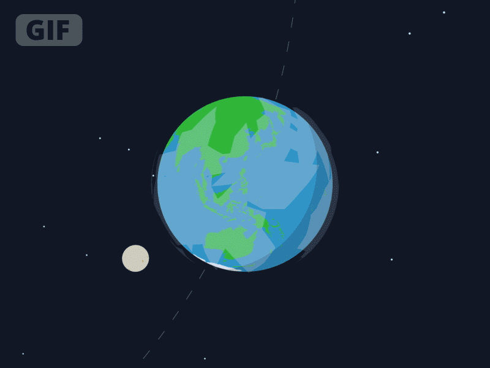
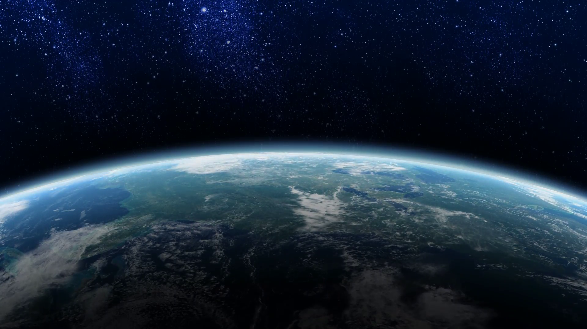

My idea for my project is to show all of the mass extinctions throughout time while updating the percentage of species lost in this present time to show how close we may be to another one.I would use past information for the mass extinctions and try to find statistics for the information i need for the 'MAYBE' extinction. What i would like for my project to do is have a globe spinning slowly while having sort of day and night effect with the globe moving and having some of the species that have died appear, do a small walk and then dissolve into the globe as the new era of species walks into the scene.At the end the globe would have impending threats to us such as nuclear warfare with a question mark and a percentage on how serious these situations may be to us.

